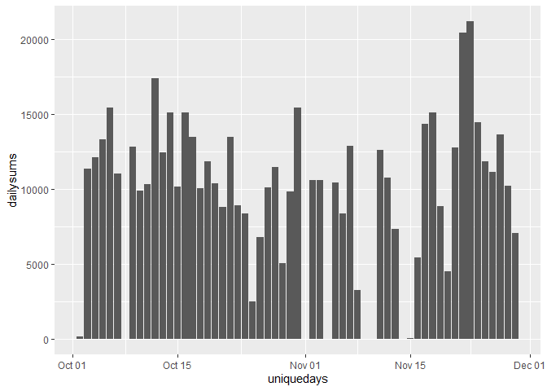
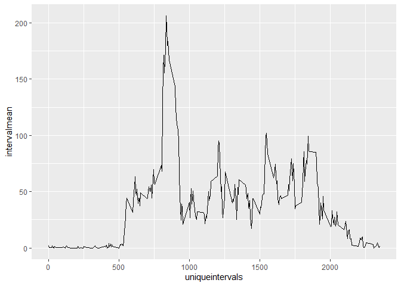
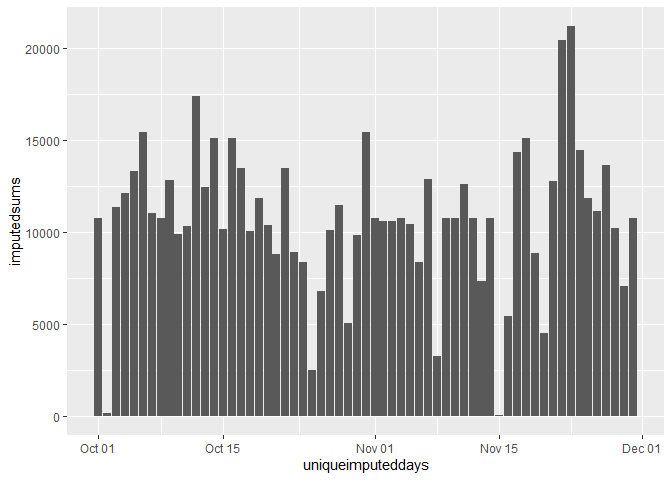
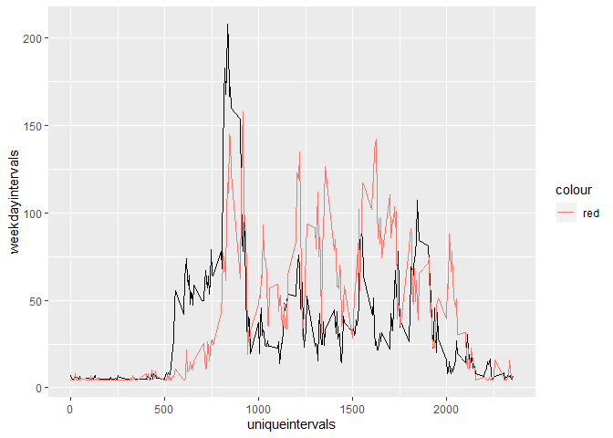

```
## Warning: package 'tidyverse' was built under R version 3.6.3
```

```
## -- Attaching packages ---------------------------------------------------- tidyverse 1.3.0 --
```

```
## v ggplot2 3.2.1     v purrr   0.3.3
## v tibble  2.1.3     v dplyr   0.8.4
## v tidyr   1.0.2     v stringr 1.4.0
## v readr   1.3.1     v forcats 0.5.0
```

```
## Warning: package 'tidyr' was built under R version 3.6.3
```

```
## Warning: package 'readr' was built under R version 3.6.3
```

```
## Warning: package 'dplyr' was built under R version 3.6.3
```

```
## Warning: package 'forcats' was built under R version 3.6.3
```

```
## -- Conflicts ------------------------------------------------------- tidyverse_conflicts() --
## x dplyr::filter() masks stats::filter()
## x dplyr::lag()    masks stats::lag()
```

## Loading and preprocessing the data


```r
#unzipping the data
if(!file.exists("activity.csv")){
  unzip("activity.zip")
}

#loading the data
activity<-read.csv("activity.csv")

#converting date to date format
activity$date<-as.Date(as.character(activity$date), "%Y-%m-%d")
```

## What is mean total number of steps taken per day?

```
## Warning: Removed 8 rows containing missing values (position_stack).
```

<!-- -->

```
## [1] "Daily Mean:  10766.1886792453"
```

```
## [1] "Daily Median:  10765"
```
## What is the average daily activity pattern?
<!-- -->

```
## [1] "Max Interval Mean Interval:  835"
```

## Imputing missing values

In order to impute the missing values I simply inserted the mean steps per interval into each NA.


```r
#calculate number of NAs
nacountlog<-sapply(activity$steps,is.na)
nacount<-sum(nacountlog)

#impute data
activityimputed<-activity
for(i in 1:nrow(activity)){
  if(is.na(activity[i,1]))
    activityimputed[i,1]<-mean(intervalmean)
}

#histogram of imputed datatable
imputedsums<-tapply(activityimputed$steps,activityimputed$date,sum)
uniqueimputeddays<-unique(activityimputed$date)
dailyimputedsumdf<-data.frame(uniqueimputeddays,imputedsums)

plot3<-ggplot(dailyimputedsumdf,aes(uniqueimputeddays, imputedsums))+
  geom_bar(stat="identity")
print(plot3)
```

<!-- -->

```r
#calculate imputed mean and median
imputedmean<-mean(dailyimputedsumdf$imputedsums)
imputedmedian<-median(dailyimputedsumdf$imputedsums)

print(paste("Imputed Mean: ", imputedmean))
```

```
## [1] "Imputed Mean:  10766.1886792453"
```

```r
print(paste("Imputed Median ", imputedmedian))
```

```
## [1] "Imputed Median  10766.1886792453"
```


## Are there differences in activity patterns between weekdays and weekends?
<!-- -->
